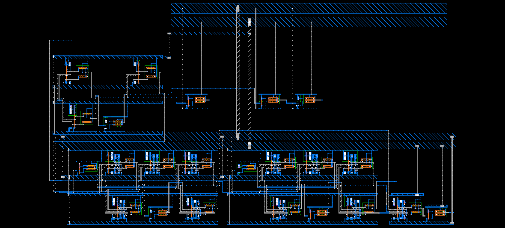
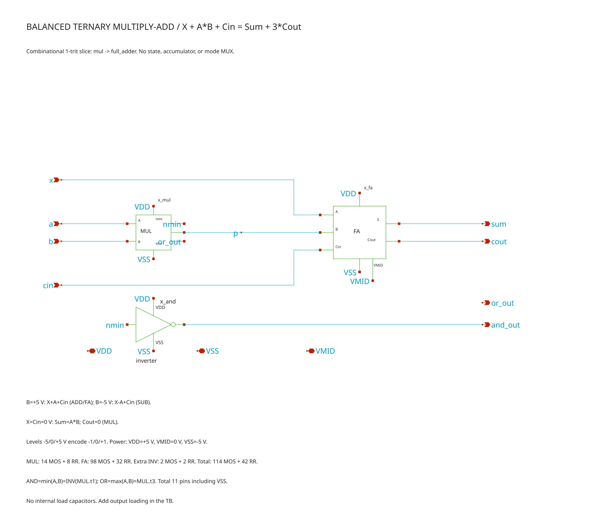

# 平衡3値 Multiply-Add / AND / OR — OpenSUSI TR-1um

1 tritの乗算加算とAND/ORを行う組合せ回路。論理値−1/0/+1を−5/0/+5 Vで表す。
共通VSSを除く10端子（電源をすべて含めると11端子）、コア外形は横1774.7×縦969.65 µm。
横1800×縦1000 µmの領域内に配置している。

## 提出物

| 項目 | ファイル |
|---|---|
| トップ回路図 | [mac.sch](mac.sch) / [mac.sym](mac.sym) |
| シミュレーション用回路図 | [mac_tb.sch](mac_tb.sch) |
| レイアウト | [mac.gds](mac.gds) — top: `mac` |
| 仕様書・説明書・端子座標 | [SPEC.md](SPEC.md) |
| 通常LVS用の階層SPICE | [simulation/mac.spice](simulation/mac.spice) |
| レイアウトからの素子抽出 | [mac.extracted](mac.extracted) |

子回路の`.sch`・`.sym`も同じフォルダに同梱。Xschem標準部品とTR-1um dev PDKは別途必要。
GDSには全子セルの図形が含まれ、外部のBTライブラリ登録や元プロジェクトのGDSは不要。
編集用ファイルと同じ階層を保ち、PCellを復元するための外部参照情報だけを外している。

## 特徴

- **1つの回路でADD / SUB / MUL / NEG / multiply-add**：`X + A×B + Cin = Sum + 3×Cout`。モード切替回路はなく、入力の与え方で演算を選ぶ。
- **平衡3進のcarryを外部へ出力**：同じ回路をcarryで直列接続できる構成。5個接続すれば5 trit加算器を構成できる。チップ間接続の実負荷は別途評価が必要。
- **AND/OR出力**：AND=min(A,B)はINV1段、OR=max(A,B)はINV2段で復元・分離する。
- **primitive → HA → FA → MACの階層を維持**：118 MOS＋46抵抗。HA内部ではSUMとCARRYの中間信号を共有する。

出力条件は各1 MΩ以上・10 pF以下・整定待ち1 µs。50 Ω直接駆動ではない。
±5 Vはユーザーが採用した定格外電源。耐圧・寿命の保証はなく、実際の相乗りフレームは未統合。
共通P基板・フレームのVSSを−5 Vとし、0 VのVMIDと混同しない。

Drawing DRC 0件・strict LVS一致。単体の製造マスクDRCには未接続の外部入力による警告14件がある。
4入力をVDDへ実配線した別の診断用親セルでは、Drawing DRC・LVS・製造マスクDRCとも合格。
最終フレームとの接続後にもマスクDRCを確認する。

検証完了。条件と未評価範囲は仕様書を参照。

## レイアウト全体

## 回路図全体

## 端子位置

