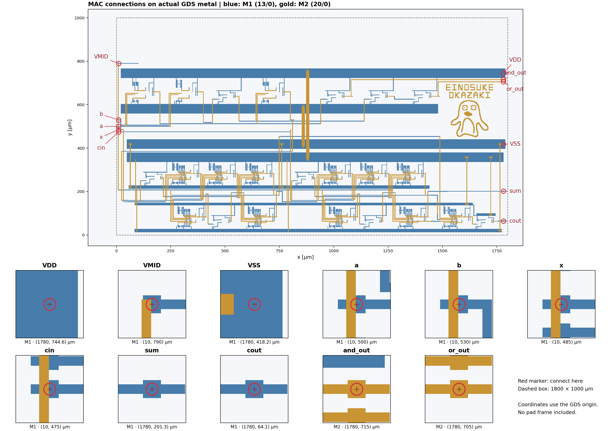
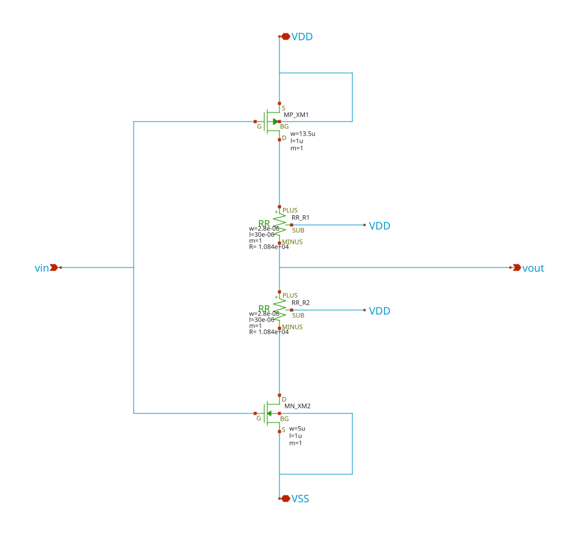
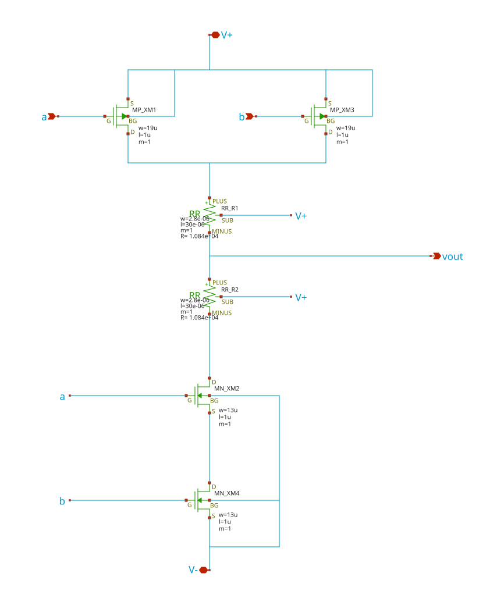
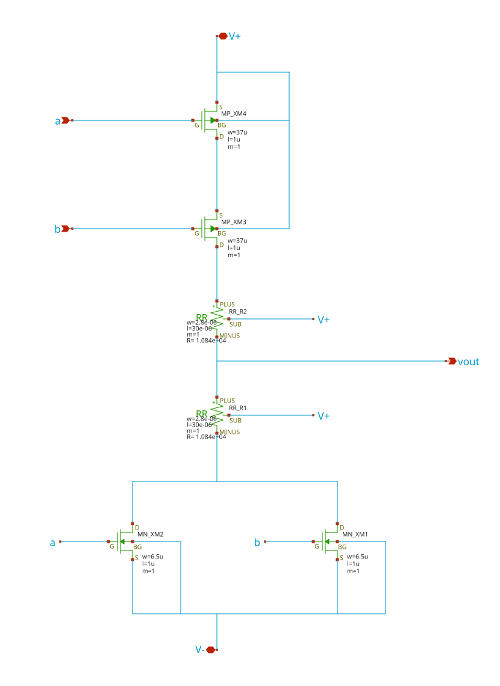
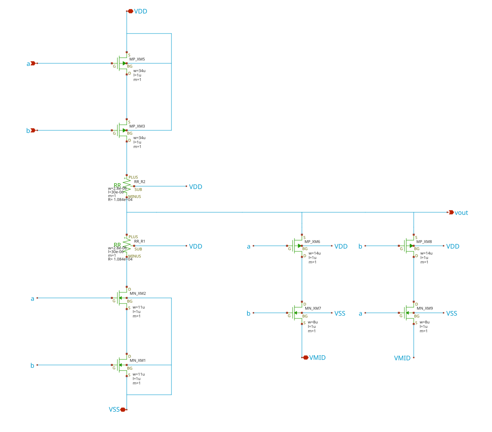

# 平衡3値 Multiply-Add仕様

## 基本仕様

| 項目 | 値 |
|---|---|
| 演算 | X + A×B + Cin = Sum + 3×Cout |
| 論理出力 | and_out=min(A,B)、or_out=max(A,B) |
| 論理値と電圧 | −1 / 0 / +1 ⇔ −5 / 0 / +5 V |
| 電源 | VDD=+5 V、VMID=0 V、VSS=−5 V |
| 回路 | 組合せ回路、PMOS 59、NMOS 59、RR 46 |
| 端子数 | 11本。共通VSSを除くと10本 |
| コア外形 | 1788.4 × 780.85 µm |
| 割当領域 | 1800 × 1000 µm |
| 提出GDSトップ | mac |
| GDS単位 | DBU=0.001 µm、配置格子0.05 µm |
| PDK | TR-1um dev、revision 9ef2ac38e1717b3ba2a4b0b374e48c53017e952c |

X、A、B、Cin、Sum、Coutは平衡3値の論理値です。共通基板とVSSは−5 V、VMIDは0 Vに接続します。

## 端子

座標はGDS原点からのµmです。TXM1（48/0）とTXM2（49/0）で端子名を示しています。

**全11端子を1800 × 1000 µmの割当領域の左右境界付近へ引き出しています。** 左側はX=10 µm、右側はX=1780 µmの接続点です。各点からそのまま外側へ水平に配線でき、外部端子同士の引き出し配線は交差しません。

| 接続辺 | 上から下への端子順 | 外部への配線方向 |
|---|---|---|
| 左辺 | VMID、B、A、X、Cin | 左向き（Xが減る方向） |
| 右辺 | VDD、AND OUT、OR OUT、VSS、Sum、Cout | 右向き（Xが増える方向） |

AND OUTとOR OUTはM2、それ以外はM1で接続します。信号端子とVMIDには6.4 × 6.4 µmの接続部を設け、VDD/VSSは幅44 µmの電源レール上で接続できます。下表の位置と層を使えば、セル内部へ配線を入れずに接続できます。

| 端子 | 方向 | 機能 | 接続層 | X | Y |
|---|---|---|---|---:|---:|
| `VDD` | 電源 | +5 V | M1 (13/0) | 1780 | 744.6 |
| `VMID` | 電源 | 0 V基準 | M1 (13/0) | 10 | 790 |
| `x` | 入力 | 加算値・外部で保持する累積値 | M1 (13/0) | 10 | 485 |
| `a` | 入力 | 被乗数 | M1 (13/0) | 10 | 500 |
| `b` | 入力 | 乗数、ADD時+1、SUB時−1 | M1 (13/0) | 10 | 530 |
| `cin` | 入力 | 下位桁からのcarry | M1 (13/0) | 10 | 475 |
| `sum` | 出力 | 演算結果の下位trit | M1 (13/0) | 1780 | 201.3 |
| `cout` | 出力 | 上位桁へのcarry | M1 (13/0) | 1780 | 64.1 |
| `and_out` | 出力 | min(a,b) | M2 (20/0) | 1780 | 715 |
| `or_out` | 出力 | max(a,b) | M2 (20/0) | 1780 | 705 |
| `VSS` | 電源 | −5 V（共通VSS） | M1 (13/0) | 1780 | 418.2 |

## 入力の与え方

| 演算 | X | A | B | Cin | 結果 |
|---|---|---|---|---|---|
| ADD | u | v | +1 | carry | u+v+carry |
| SUB | u | v | −1 | carry | u−v+carry |
| MUL | 0 | u | v | 0 | Sum=u×v、Cout=0 |
| NEG | 0 | u | −1 | 0 | Sum=−u、Cout=0 |
| Multiply-add | acc | u | v | carry | acc+u×v+carry |

ADD/SUBではCoutを次段のCinへ接続して多tritの計算を行えます。5段連結の代表試験では、正負carry伝搬など19種類の入力を5 µs保持で確認しました。各段の出力に10 pF || 1 MΩを接続し、Coutには次段Cinの入力容量も接続しています。

## 真理値表

値は論理値 **−1 / 0 / +1** です。Sumはその桁、Coutは次の桁へ渡す値で、結果は **Sum + 3×Cout** として読みます。例えば−2はSum=+1、Cout=−1です。

### ADD

X=u、A=v、B=+1。**u + v + Cin = Sum + 3×Cout**。Cinごとに9通り、計27通りを示します。

#### Cin = 0（下位桁からのcarryなし）

| 入力 u | 入力 v | 演算結果 | 出力 Sum | 出力 Cout |
|---:|---:|---:|---:|---:|
| −1 | −1 | −2 | **+1** | −1 |
| −1 | 0 | −1 | **−1** | 0 |
| −1 | +1 | 0 | **0** | 0 |
| 0 | −1 | −1 | **−1** | 0 |
| 0 | 0 | 0 | **0** | 0 |
| 0 | +1 | +1 | **+1** | 0 |
| +1 | −1 | 0 | **0** | 0 |
| +1 | 0 | +1 | **+1** | 0 |
| +1 | +1 | +2 | **−1** | +1 |

#### Cin = −1

| 入力 u | 入力 v | 演算結果 | 出力 Sum | 出力 Cout |
|---:|---:|---:|---:|---:|
| −1 | −1 | −3 | **0** | −1 |
| −1 | 0 | −2 | **+1** | −1 |
| −1 | +1 | −1 | **−1** | 0 |
| 0 | −1 | −2 | **+1** | −1 |
| 0 | 0 | −1 | **−1** | 0 |
| 0 | +1 | 0 | **0** | 0 |
| +1 | −1 | −1 | **−1** | 0 |
| +1 | 0 | 0 | **0** | 0 |
| +1 | +1 | +1 | **+1** | 0 |

#### Cin = +1

| 入力 u | 入力 v | 演算結果 | 出力 Sum | 出力 Cout |
|---:|---:|---:|---:|---:|
| −1 | −1 | −1 | **−1** | 0 |
| −1 | 0 | 0 | **0** | 0 |
| −1 | +1 | +1 | **+1** | 0 |
| 0 | −1 | 0 | **0** | 0 |
| 0 | 0 | +1 | **+1** | 0 |
| 0 | +1 | +2 | **−1** | +1 |
| +1 | −1 | +1 | **+1** | 0 |
| +1 | 0 | +2 | **−1** | +1 |
| +1 | +1 | +3 | **0** | +1 |

### SUB

X=u、A=v、B=−1。**u − v + Cin = Sum + 3×Cout**。Cinごとに9通り、計27通りを示します。

#### Cin = 0（下位桁からのcarryなし）

| 入力 u | 入力 v | 演算結果 | 出力 Sum | 出力 Cout |
|---:|---:|---:|---:|---:|
| −1 | −1 | 0 | **0** | 0 |
| −1 | 0 | −1 | **−1** | 0 |
| −1 | +1 | −2 | **+1** | −1 |
| 0 | −1 | +1 | **+1** | 0 |
| 0 | 0 | 0 | **0** | 0 |
| 0 | +1 | −1 | **−1** | 0 |
| +1 | −1 | +2 | **−1** | +1 |
| +1 | 0 | +1 | **+1** | 0 |
| +1 | +1 | 0 | **0** | 0 |

#### Cin = −1

| 入力 u | 入力 v | 演算結果 | 出力 Sum | 出力 Cout |
|---:|---:|---:|---:|---:|
| −1 | −1 | −1 | **−1** | 0 |
| −1 | 0 | −2 | **+1** | −1 |
| −1 | +1 | −3 | **0** | −1 |
| 0 | −1 | 0 | **0** | 0 |
| 0 | 0 | −1 | **−1** | 0 |
| 0 | +1 | −2 | **+1** | −1 |
| +1 | −1 | +1 | **+1** | 0 |
| +1 | 0 | 0 | **0** | 0 |
| +1 | +1 | −1 | **−1** | 0 |

#### Cin = +1

| 入力 u | 入力 v | 演算結果 | 出力 Sum | 出力 Cout |
|---:|---:|---:|---:|---:|
| −1 | −1 | +1 | **+1** | 0 |
| −1 | 0 | 0 | **0** | 0 |
| −1 | +1 | −1 | **−1** | 0 |
| 0 | −1 | +2 | **−1** | +1 |
| 0 | 0 | +1 | **+1** | 0 |
| 0 | +1 | 0 | **0** | 0 |
| +1 | −1 | +3 | **0** | +1 |
| +1 | 0 | +2 | **−1** | +1 |
| +1 | +1 | +1 | **+1** | 0 |

### MUL

X=0、A=u、B=v、Cin=0。表の中身が **Sum=u×v** です。Coutは全9通りで0です。行でu、列でvを選びます。

| u ＼ v | −1 | 0 | +1 |
|---:|---:|---:|---:|
| −1 | +1 | 0 | −1 |
| 0 | 0 | 0 | 0 |
| +1 | −1 | 0 | +1 |

## 検証結果

理想±5 V / 0 V電源、27 ℃、1 ns入力エッジ、各出力10 pF || 1 MΩで測定しました。Sum / Cout / AND / ORと内部積Pを期待値±0.5 Vで判定しています。

| 回路 | 試験 | 負荷 | 最大出力誤差 | 最大整定時間 | 判定 |
|---|---|---:|---:|---:|---|
| 回路図 | 81入力＋復帰 | 10 pF/出力 | 61.307 mV | 415.47 ns | PASS |
| 回路図 | 全6,480遷移 | 10 pF/出力 | 64.297 mV | 504.31 ns | PASS |
| 回路図 | 1入力648遷移 | 10 pF/出力 | 64.107 mV | 499.41 ns | PASS |
| 抽出回路 | 81入力＋復帰 | 10 pF/出力 | 61.286 mV | 414.27 ns | PASS |
| 抽出回路 | 全6,480遷移 | 10 pF/出力 | 64.262 mV | 503.67 ns | PASS |
| 抽出回路 | 1入力648遷移 | 10 pF/出力 | 64.085 mV | 485.87 ns | PASS |

SUM/Coutの最大誤差は 64.297 mV、AND/ORの最大誤差は 60.530 mV。

最終抽出回路で81入力、全6,480有向遷移、単一入力648遷移を確認しました。5段連結の代表試験も全23区間で合格し、最大整定時間は約1.181 µsでした。

レイアウトはTR-1um dev版のDrawing DRC 0件、階層内の全セルとトップ端子を含むstrict LVS一致。入力をVDDへ配線した診断用親セルでは、製造マスクDRCも0件です。提出GDSと編集用GDSの図形・ラベルも一致しています。

## Xschem・KLayoutでの使い方

TR-1um dev PDKを設定したXschemでmac_tb.schを開き、Netlist → Simulateを実行します。XSCHEM_LIBRARY_PATHにこのフォルダとPDKのlibs.tech/xschemを含め、LIBをPDKのlibs.tech/spice/modelsに設定します。TBのCsum / Ccout / Cand_out / Cor_outで出力容量を設定します。

KLayoutではmac.gdsのトップmacを開きます。通常LVSの回路参照は同梱のsimulation/mac.spiceです。mac.extractedは素子抽出結果として利用できます。

## 採用した基本ゲート（primitive）

primitiveは、MOSと抵抗から直接作り、他の論理セルを内部に含まない基本セルです。本回路では下記の4種類の論理機能を、`inverter`、`mul_inv`、`mul_nand`、`mul_nor`、`nany`の5セルで実装しています。回路図は提出する `.sch` から出力したものです。図をクリックすると拡大できます。

各真理値表は理想的な論理値を示します。−1 / 0 / +1は−5 / 0 / +5 Vに対応します。図中のV+はVDD、V−はVSSです。RRはPDKの抵抗素子で、全セルのRRはW=2.8 µm、L=30 µm、SUB端子はVDDへ接続します。全MOSのLは1 µmです。

### INV：符号反転

**Y = −A**。PMOSとNMOS各1個、抵抗2個で構成し、入力0では抵抗分圧で出力0を作ります。

`inverter`は加算器と出力復元用、`mul_inv`はMUL内部用のセル名です。現在は両者の接続と素子寸法が同じで、この回路図・真理値表が共通です。PMOSのW=13.5 µm、NMOSのW=5 µmです。

回路ファイル：[inverter.sch](inverter.sch)、[mul_inv.sch](mul_inv.sch)。図中のvinがA、voutがYです。

| 入力 A | 出力 Y |
|---:|---:|
| −1 | +1 |
| 0 | 0 |
| +1 | −1 |

### NAND：小さい方を反転

**Y = −min(A,B)**。PMOS2個を並列、NMOS2個を直列に接続し、抵抗2個で中間値を生成します。PMOSのW=19 µm、NMOSのW=13 µmです。

回路ファイル：[mul_nand.sch](mul_nand.sch)。行がA、列がB、表の中身が出力Yです。

| A ＼ B | −1 | 0 | +1 |
|---:|---:|---:|---:|
| −1 | +1 | +1 | +1 |
| 0 | +1 | 0 | 0 |
| +1 | +1 | 0 | −1 |

### NOR：大きい方を反転

**Y = −max(A,B)**。PMOS2個を直列、NMOS2個を並列に接続し、抵抗2個で中間値を生成します。PMOSのW=37 µm、NMOSのW=6.5 µmです。

回路ファイル：[mul_nor.sch](mul_nor.sch)。行がA、列がB、表の中身が出力Yです。

| A ＼ B | −1 | 0 | +1 |
|---:|---:|---:|---:|
| −1 | +1 | 0 | −1 |
| 0 | 0 | 0 | −1 |
| +1 | −1 | −1 | −1 |

### NANY：飽和加算の符号反転

**Y = −sat(A+B)**。satは、和が+1より大きければ+1、−1より小さければ−1に収める演算です。

主回路は直列PMOS2個・直列NMOS2個と抵抗2個です。さらに4個のMOSでVMIDへの経路を作り、入力が逆符号（−1,+1または+1,−1）のときに出力を0 Vへ戻します。合計8 MOS＋2 RRです。主回路のPMOS/NMOSはW=34/11 µm、0 VクランプのPMOS/NMOSはW=14/8 µmです。

回路ファイル：[nany.sch](nany.sch)。行がA、列がB、表の中身が出力Yです。

| A ＼ B | −1 | 0 | +1 |
|---:|---:|---:|---:|
| −1 | +1 | +1 | 0 |
| 0 | +1 | 0 | −1 |
| +1 | 0 | −1 | −1 |

## セル階層

上記の基本ゲートを組み合わせ、MUL・HA・FA・MACを構成します。

| セル | 構成 |
|---|---|
| MAC | MUL ×1、FA ×1、出力復元用INV ×3 |
| MUL | NAND ×2、NOR ×1、INV ×1 |
| FA | HA ×2、NANY ×1、INV ×1 |
| HA | NANY ×5、INV ×2。SUMとCARRYの中間信号を共有 |

NANYは−sat(A+B)を8 MOS＋2 RRで実装しています。
